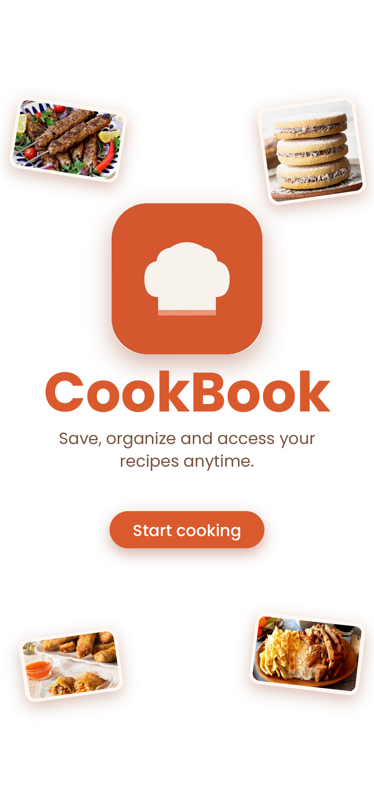
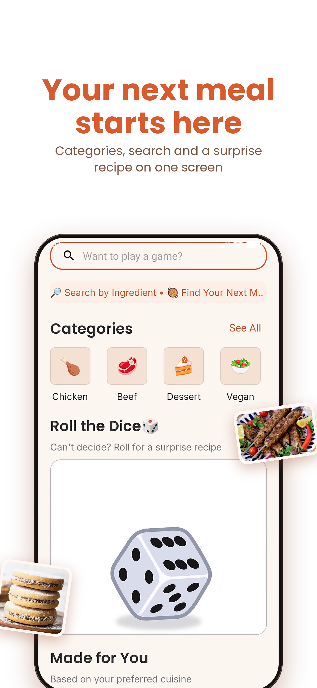
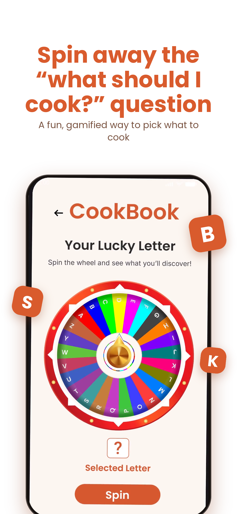
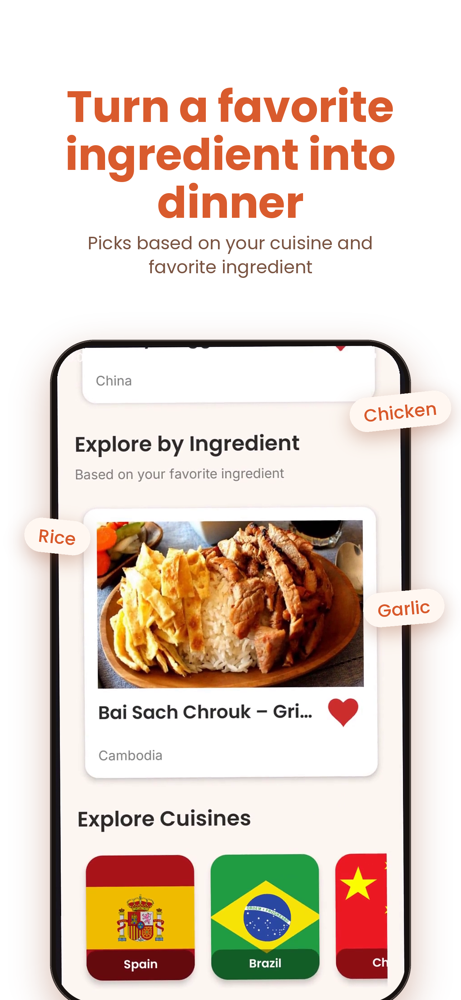
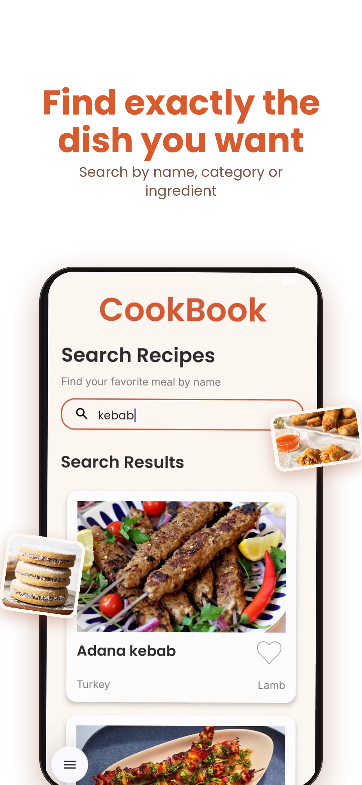
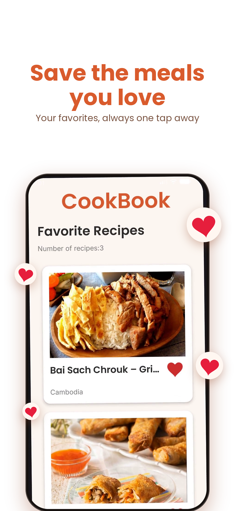
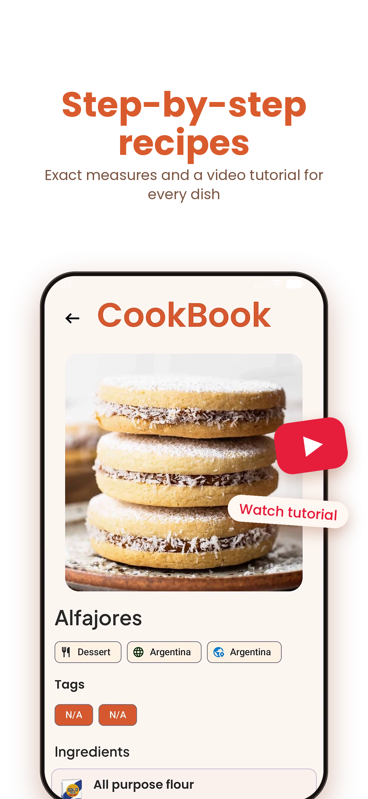
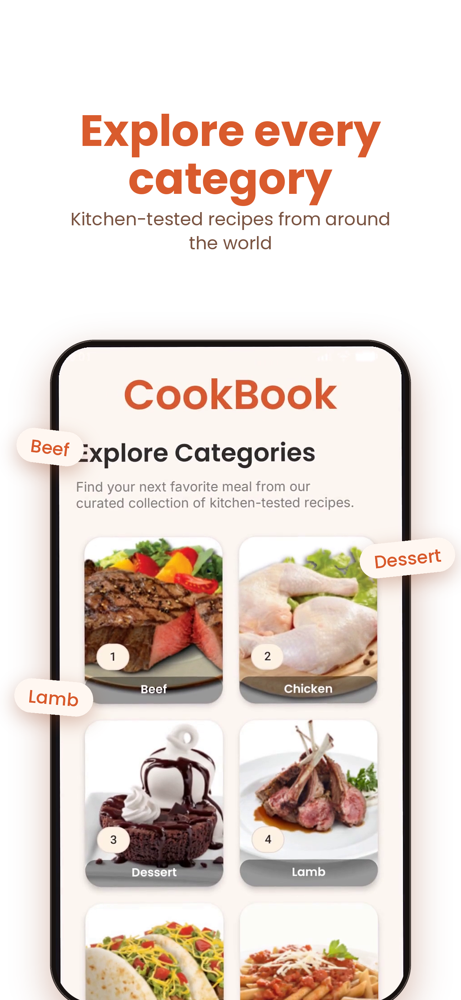
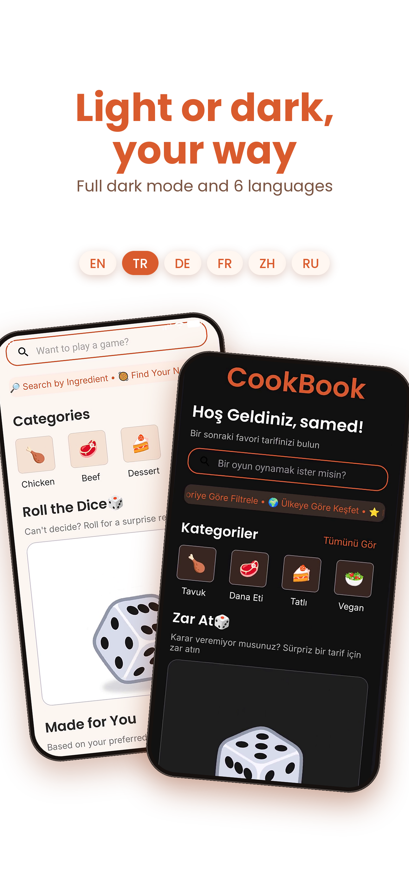

<div align="center">
  

  # CookBook

  **A Whisk Worth Taking!**

  
  
  
  
  
  

</div>

---

## 📌 Overview

CookBook is a native Android application engineered in Kotlin for discovering, filtering, and organizing global culinary recipes. Built with modern Android architecture guidelines, the app features dynamic REST API integration, local database caching, interactive decision-making tools, and multi-language localization.

---

## 📹 Video Demo

<div align="center">
  <video
    src="https://github.com/user-attachments/assets/976b795c-5172-4aaa-83bb-0a2f086a9645"
    controls
    loop
    playsinline
    width="100%">
  </video>
</div>

---

## 📸 App Showcase

<div align="center">

  <table>
    <tr>
      <td align="center"><br><sub><b>Hero & Onboarding</b></sub></td>
      <td align="center"><br><sub><b>Home Dashboard</b></sub></td>
      <td align="center"><br><sub><b>Spin the Wheel Game</b></sub></td>
    </tr>
    <tr>
      <td align="center"><br><sub><b>Explore by Ingredient</b></sub></td>
      <td align="center"><br><sub><b>Search & Filter</b></sub></td>
      <td align="center"><br><sub><b>Favorite Meals</b></sub></td>
    </tr>
    <tr>
      <td align="center"><br><sub><b>Recipe Details</b></sub></td>
      <td align="center"><br><sub><b>Categories</b></sub></td>
      <td align="center"><br><sub><b>Dark Mode & Languages</b></sub></td>
    </tr>
  </table>

</div>

---

## ✨ Key Modules & Features

- **Interactive Onboarding:** Guided multi-screen onboarding flow built with `ViewPager2` and animated page indicators (`DotsIndicator`).
- **Dynamic Recipe Discovery:** Fetch and browse recipes across global cuisines, categories, or specific ingredients via REST API endpoints.
- **World Cuisine Exploration:** Explore dishes by country flags (Spain, Brazil, China, France, Turkey, Japan, and more).
- **Spin the Wheel Game:** Gamified 26-letter decision wheel ("Your Lucky Letter") in `GameFragment` helping indecisive users choose a meal based on random lucky letters.
- **Roll the Dice Randomizer:** One-tap random meal generator on the Home Screen featuring custom Lottie animations for instant recipe discovery.
- **Smart Instructions Formatting:** Raw API recipe data is dynamically parsed and formatted into numbered steps with bold headers, complete ingredient lists with measures, and clear formatting.
- **One-Click YouTube Video Tutorials:** Direct integration launching YouTube video guides for step-by-step visual cooking assistance.
- **Personalized Content Sections:** Dynamic "Made for You" (based on preferred cuisine) and "Explore by Ingredient" sections adapting to user choices.
- **Search & Shimmer Skeleton Loading:** Instant recipe search by keyword with real-time feedback and smooth Facebook Shimmer skeleton placeholders.
- **Local Persistence & Favorites:** Save and manage favorite recipes offline using Room Database with animated Lottie heart toggles.
- **Profile Customization & Photo Storage:** User profile photo selection from local device storage, profile information updates, and dark theme toggling.
- **Localization:** Full multi-language support across 6 languages (English, Turkish, German, French, Chinese, and Russian).
- **Secure Session Cleanup:** Complete preferences and database cleanup upon account deletion for user privacy.

---

## 🛠️ Architecture & Technology Stack

- **Language:** Kotlin
- **Architecture:** MVVM (Model-View-ViewModel), Repository Pattern, Sealed UI States
- **UI Layer:** ViewBinding, Material 3 Design, Jetpack Navigation SafeArgs, ViewPager2
- **Local Storage:** Room Database, SharedPreferences (SessionManager)
- **Networking:** Retrofit 2, Gson Converter
- **Image & UI Feedback:** Glide (with skeleton placeholders and error fallbacks), Facebook Shimmer, Lottie Animations

---

## 🚀 Setup & Installation

1. Clone the repository:
   ```bash
   git clone https://github.com/YOUR_USERNAME/CookBook.git
   ```
2. Open the project in Android Studio.
3. Allow Gradle to sync dependencies, then run the application on an emulator or physical Android device.

---

## 📄 License

This project is open-source under the [MIT License](LICENSE).
